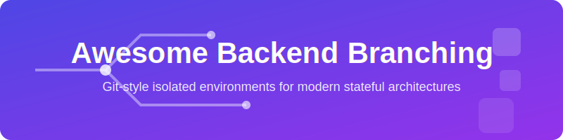

  

  
  
  
  

---

# 🚀 Awesome Backend Branching
### A curated list of tools and frameworks for Git-style branching of stateful architectures.

**Backend Branching** allows developers to manage databases, user management, and cloud infrastructure using isolated environments that mimic `git branch` workflows. Stop fighting with shared staging environments and start shipping faster with ephemeral backends. ⚡

---

## 📑 Table of Contents
*   [🌟 Why Backend Branching?](#-why-backend-branching)
*   [🌍 1. Complete Environment Branching Tools](#1-complete-environment-branching-tools)
*   [💾 2. Database-Level Branching Tools](#2-database-level-branching-tools-copy-on-write)
*   [📜 3. Database Schema Versioning Frameworks](#3-database-schema-versioning-frameworks)
*   [☁️ 4. Backend Cloud & Mock Infrastructure](#4-backend-cloud--mock-infrastructure-branching)
*   [📂 5. Open-Source & Self-Hosted Alternatives](#5-open-source--self-hosted-alternatives)
*   [🤝 Contributing](#-contributing)

---

  

### 🎯 The Problem
Traditional development workflows struggle with **stateful bottlenecks**:
1.  **Shared Databases:** Multiple developers overwriting each other's test data.
2.  **Stale Environments:** Staging environments that don't match production schemas.
3.  **Deployment Risk:** High-risk migrations that can't be safely tested against production-grade clones.

### ✨ The Solution: Git-Style Branching
By applying branching principles to the backend, you get:
*   **Isolation:** Every PR gets its own full backend stack. 🛡️
*   **Speed:** Instant clones of TB-scale databases using copy-on-write. 🏎️
*   **Safety:** Test migrations against real data without risk. ⛑️

  

## 🌍 1. Complete Environment Branching Tools
These advanced systems treat the entire backend ecosystem—not just the database—as a branchable asset. They are ideal for modern microservices and rapid preview deployments. 🛠️

| Product | Company Size (Valuation) | Pricing (Paid Tiers) | Free Tier Limits |
| :--- | :--- | :--- | :--- |
| **[Encore](https://encore.dev)** | ~$25M | **Pro:** $49/member/mo + usage | **Free:** 2 dev envs, 1M tracing events, 1 concurrent build, 7-day retention. |
| **[Nitric](https://nitric.io)** | ~$20M | **Open Source:** $0 | **Framework is free.** Pay cloud providers (AWS/GCP/Azure) only for resource usage. |
| **[InsForge](https://insforge.dev/)** | ~$15M | **Pro:** ~$25/mo | **Free:** 2 instances, 500MB DB, 5GB bandwidth. *Pauses after 1 week inactivity.* |

*   **[InsForge Backend Branching](https://insforge.dev/)**: An open-source, AI-native cloud infrastructure platform that clones the **entire backend environment** in an instant. With a single action, you can spin up isolated, full copies of your PostgreSQL database, authentication rules, storage buckets, and edge functions.
*   **[Nitric](https://nitric.io) or [Encore](https://encore.dev)**: Infrastructure-as-code frameworks that dynamically interpret backend needs and deploy completely isolated "ephemeral backends" or preview environments every time a new Git Pull Request is opened.

  

## 💾 2. Database-Level Branching Tools (Copy-on-Write)
These modern, cloud-native databases allow you to spin up an isolated database branch—containing both live production schemas and data—in seconds via a CLI or CI/CD pipelines without duplicating actual storage blocks. 🧊

| Product | Company Size (Valuation) | Pricing (Paid Tiers) | Free Tier Limits |
| :--- | :--- | :--- | :--- |
| **[Supabase](https://supabase.com)** | ~$10.5B | **Pro:** $25/mo | **Free:** 500 MB DB, 50k MAUs, 1 GB storage. *Pauses after 7 days inactivity.* |
| **[Neon](https://neon.tech)** | ~$1.0B | **Launch:** $5/mo min | **Free:** 100 CU-hours/mo, 0.5 GB storage, 10 branches. *Scale-to-zero mandatory.* |
| **[Xata](https://xata.io)** | ~$160M | **Standard:** $8/mo | **Free:** 15 GB storage, 250k records. *Does not pause projects.* |
| **[PlanetScale](https://planetscale.com)** | ~$150M | **Dev:** $5/mo \| **Scaler:** $39/mo | **None.** Hobby tier discontinued April 2024. |
| **[DoltHub](https://www.dolthub.com/)** | ~$60M | **Pro:** $5/mo (private) | **Free:** Unlimited public databases. Private DBs up to 100MB storage. |

*   **[Neon](https://neon.tech)**: A serverless open-source **PostgreSQL** platform built explicitly around Git-style workflows. Developers can instantly branch a Postgres database to safely run schema migrations or test APIs against real production records.
*   **[Dolt](https://github.com)**: Marketed literally as **"Git for Data"**. This is a SQL database built natively on a Git version control engine, letting you run commands like `dolt branch`, `dolt commit`, and `dolt merge` straight from your terminal.
*   **[PlanetScale](https://planetscale.com)**: A serverless **MySQL** platform utilizing Vitess that brings Git principles to databases. It allows developers to create isolated schema branches and use "Deploy Requests" (similar to Pull Requests) to safely merge changes without downtime.
*   **[Xata](https://xata.io)**: A serverless data platform built on PostgreSQL that provides native database branching to safely build and test schema updates before merging them into live production APIs.
*   **[Supabase](https://supabase.com)**: Leverages its local CLI and staging workflows to let engineers connect distinct Git source control branches with isolated database preview environments.

  

## 📜 3. Database Schema Versioning Frameworks
If you are using traditional, self-hosted databases (like standard Postgres, MySQL, or SQL Server) and want your schemas to follow your Git code branches precisely, these tools track changes as versioned source code: 📑

| Product | Company Size (Valuation) | Pricing (Paid Tiers) | Free Tier Limits |
| :--- | :--- | :--- | :--- |
| **[Flyway](https://flywaydb.org)** | ~$200M | ~$650/user/year | **Community:** Free. Supports 50+ DBs, basic migrations. |
| **[Liquibase](https://liquibase.com)** | ~$150M | ~$5,000/year (Ent) | **Community:** Free OSS. Core change management for 30+ DBs. |
| **[Atlas Cloud](https://atlasgo.io)** | ~$80M | $9/seat/month | **Open:** $0. 1 project, 2 target DBs, 3 seats, 30-day retention. |

*   **[Liquibase](https://liquibase.com)**: An enterprise engine that tracks, versions, and deploys database schema changes. It integrates directly into your code repository to guarantee updates move through CI/CD alongside Git feature branches.
*   **[Flyway](https://flywaydb.org)**: A lightweight version-control tool for your database. Migrations are cataloged as plain SQL scripts or Java code and managed sequentially inside your Git feature branches.
*   **[Atlas](https://atlasgo.io)**: An open-source engine for managing schemas using a declarative approach (conceptually similar to "Terraform for databases"), making it a natural fit for GitOps backend pipelines.

  

## ☁️ 4. Backend Cloud & Mock Infrastructure Branching
To branch cloud logic, heavy integrations, and third-party dependencies without running into environment limits: ☁️

| Product | Company Size (Valuation) | Pricing (Paid Tiers) | Free Tier Limits |
| :--- | :--- | :--- | :--- |
| **[Harness](https://harness.io)** | ~$5.5B | Usage-based | **Free:** $0. 2,000 cloud credits/mo. |
| **[LaunchDarkly](https://launchdarkly.com)** | ~$3.0B | $12/conn/mo + MAU | **Developer:** $0. 1 project, 3 envs, 1k contexts. |
| **[LocalStack](https://localstack.cloud)** | ~$120M | $39/license/mo | **Hobby:** $0 for non-commercial use. Requires account. |

*   **[LocalStack](https://localstack.cloud)**: Emulates a complete AWS cloud environment (S3, DynamoDB, Lambda) locally. This lets every individual engineer run an isolated, offline "cloud branch" right on their machine.
*   **[LaunchDarkly](https://launchdarkly.com) or [Harness](https://harness.io)**: Advanced feature flag platforms that decouple backend code deployment from actual runtime visibility. They enable you to merge code to the `main` branch while wrapping new endpoints in a flag, mimicking a dynamic branch in production.

  

## 📂 5. Open-Source & Self-Hosted Alternatives
For teams that prefer self-hosting or require 100% open-source software without SaaS dependencies. 🔓

| Product | GitHub Repo | License / Pricing | Key Capability |
| :--- | :--- | :--- | :--- |
| **[LocalStack](https://github.com/localstack/localstack)**  | [localstack/localstack](https://github.com/localstack/localstack) | Apache-2.0 / $0* | Local AWS cloud emulation for isolated testing. |
| **[PocketBase](https://pocketbase.io)**  | [pocketbase/pocketbase](https://github.com/pocketbase/pocketbase) | MIT / $0 | Single-file Go backend with SQLite branching. |
| **[OpenTofu](https://opentofu.org)**  | [opentofu/opentofu](https://github.com/opentofu/opentofu) | MPL-2.0 / $0 | OSS Terraform fork for environment branching. |
| **[Dolt](https://github.com/dolthub/dolt)**  | [dolthub/dolt](https://github.com/dolthub/dolt) | Apache-2.0 / $0 | SQL database with Git-like branch/merge. |
| **[Bytebase](https://github.com/bytebase/bytebase)**  | [bytebase/bytebase](https://github.com/bytebase/bytebase) | Apache-2.0 / $0* | Database CI/CD with GitOps branching. |
| **[Database Lab](https://github.com/postgres-ai/database-lab-engine)**  | [postgres-ai/dle](https://github.com/postgres-ai/database-lab-engine) | Apache-2.0 / $0 | Instant thin cloning for multi-TB Postgres DBs. |

*\* Note: Some tools offer "Community Editions" that are free for self-hosting, while advanced features may require a Pro/Enterprise license.*

*   **[Dolt](https://github.com/dolthub/dolt)**: The only SQL database that truly implements the Git versioning model (commit, branch, merge) at the storage engine level.
*   **[Database Lab Engine](https://github.com/postgres-ai/database-lab-engine)**: Uses ZFS/LVM clones to allow developers to create full-size Postgres clones in seconds, regardless of database size.
*   **[PocketBase](https://github.com/pocketbase/pocketbase)**: A compact, open-source backend consisting of a single file. Highly portable for developers who want to "branch" their entire backend by simply copying a folder.
*   **[Bytebase](https://github.com/bytebase/bytebase)**: An open-source database DevOps tool that treats database changes as code, allowing you to manage schema branches across different environments (Dev, Staging, Prod).

---

## 🤝 Contributing
Contributions are what make the open-source community such an amazing place to learn, inspire, and create. Any contributions you make are **greatly appreciated**. 💖

1.  Fork the Project
2.  Create your Feature Branch (`git checkout -b feature/AmazingFeature`)
3.  Commit your Changes (`git commit -m 'Add some AmazingFeature'`)
4.  Push to the Branch (`git push origin feature/AmazingFeature`)
5.  Open a Pull Request

---

## 📈 Star History

   <a href="https://www.star-history.com/?repos=ishandutta2007%2FAwesome-Backend-Branching&type=date&legend=bottom-right">
    <picture>
      <source media="(prefers-color-scheme: dark)" srcset="https://api.star-history.com/chart?repos=ishandutta2007/Awesome-Backend-Branching&type=date&theme=dark&legend=bottom-right" />
      <source media="(prefers-color-scheme: light)" srcset="https://api.star-history.com/chart?repos=ishandutta2007/Awesome-Backend-Branching&type=date&legend=bottom-right" />
      
    </picture>
   </a>

---

  Built with ❤️ by the Backend Branching Community.

